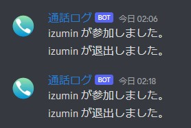

# Discord通話参加時に通知させるBot
### 環境
- Python-3.8
- Discord.py 2.1.0

### 概要
- 通話参加時にロールを付与
- 通話退室時にロールを外す
- 特定のチャンネルに通話参加/退室の通知を飛ばす
- 通知には参加した人のニックネームない場合はユーザー名を含む「〇〇さんが(参加|退室)しました」
- TTSによる読み上げ

### 実行方法
1. DiscordAppからbotを作成する。[作成ページ](https://discord.com/developers/applications)
2. Botのトークンを取得
3. サーバに通話時のみに付与させるロールを作成
4. プログラムにトークン, ロールID, 通知させるテキストチャンネルなどを変数に埋め込む
5. 実行する

### イメージ
